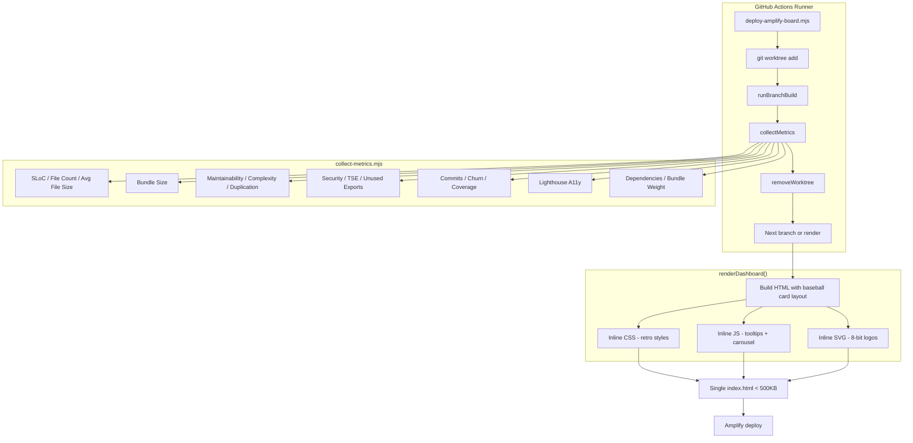

# Design Document: AI Baseball Cards Dashboard

## Overview

This design transforms the existing Category Solitaire Amplify deployment dashboard from a simple card grid into a metrics-rich, retro baseball-card-styled scorecard that compares four AI coding tool variants. The implementation adds two major capabilities:

1. **Metrics Collection** — A standalone `scripts/collect-metrics.mjs` module that runs code analysis tools against each branch worktree during CI, producing structured JSON metric data.
2. **Baseball Card UI** — A complete visual overhaul of `renderDashboard()` in `scripts/deploy-amplify-board.mjs` that presents each branch as a 1980s-style baseball card with stat groups, pixel-art logos, tooltip-enabled abbreviations, and a mobile-first swipeable carousel.

Both capabilities integrate into the existing sequential deploy flow without breaking backward compatibility. The dashboard remains a single static HTML file with zero runtime dependencies.

## Architecture



### Integration Point

The deploy script's existing `for` loop over `metadata` gains one new call after `runBranchBuild(worktree)`:

```javascript
import { collectMetrics } from './collect-metrics.mjs';
// ...
const metrics = await collectMetrics(worktree, branch);
deployedBranches.push({ ...branch, url, metrics });
```

The `renderDashboard` function receives `deployedBranches` with an additional `metrics` field on each entry.

## Components and Interfaces

### 1. Metrics Collector (`scripts/collect-metrics.mjs`)

**Exported Interface:**

```typescript
interface MetricsResult {
  sloc: number | null;           // Source Lines of Code
  fileCount: number | null;      // Total file count
  avgFileSize: number | null;    // Average file size (lines)
  bundleSize: number | null;     // Bundle size (KB)
  maintainability: number | null; // Maintainability Index (0-100)
  maxComplexity: number | null;  // Maximum Cyclomatic Complexity
  duplication: number | null;    // Duplication Percentage
  securityIssues: number | null; // Security issue count
  tsErrors: number | null;       // TypeScript strict-mode error count
  unusedExports: number | null;  // Unused export count
  commits: number | null;        // Commit count
  churn: number | null;          // Code churn (lines added + deleted)
  coverage: number | null;       // Test coverage percentage
  lighthouseA11y: number | null; // Lighthouse Accessibility Score
  depCount: number | null;       // Dependency count
  bundleWeight: number | null;   // Bundle weight (KB)
}

export async function collectMetrics(
  worktreePath: string,
  branchMeta: { sourceRef: string; deployBranch: string; label: string }
): Promise<MetricsResult>;
```

**Internal Design:**

- Each metric is collected by a dedicated async helper function with its own 30-second `AbortController` timeout.
- A top-level 120-second `setTimeout` acts as a circuit breaker; when triggered, it aborts all in-progress metric helpers and returns partial results with `null` for uncollected metrics.
- Metric helpers run sequentially to avoid resource contention on the CI runner (single-core ubuntu-latest).
- The module uses only Node.js built-in APIs (`child_process`, `fs`, `path`) plus analysis tools expected in `node_modules/.bin` from the project's devDependencies.

**Metric Collection Strategies:**

| Metric | Tool / Approach |
|--------|----------------|
| SLoC, File Count, Avg File Size | `find` + `wc -l` on `src/` |
| Bundle Size | `fs.statSync` on `dist/` output |
| Maintainability Index | `escomplex` or `typhonjs-escomplex` |
| Max Cyclomatic Complexity | Same as maintainability (escomplex) |
| Duplication Percentage | `jscpd --reporters json` |
| Security Issues | `npm audit --json` (count advisories) |
| TS Strict Errors | `tsc --noEmit --strict` (count error lines) |
| Unused Exports | `ts-unused-exports` or `knip` |
| Commit Count | `git log --oneline \| wc -l` |
| Code Churn | `git log --numstat --format=""` (sum additions + deletions) |
| Test Coverage | `vitest run --coverage` (parse lcov summary) |
| Lighthouse A11y | `@lhci/cli` or `lighthouse` CLI against built dist |
| Dependency Count | Parse `package.json` dependencies + devDependencies |
| Bundle Weight | `dist/**/*.js` total size |

### 2. Deploy Script Changes (`scripts/deploy-amplify-board.mjs`)

**Modified Functions:**

- `main()` — imports `collectMetrics`, calls it after build, attaches result to branch entry
- `renderDashboard(app, deployedBranches)` — complete rewrite of HTML template to produce baseball card layout

**New Behavior with `--skip-build`:**

When `--skip-build` is active, metrics collection is skipped entirely. Each branch receives a metrics object with all fields set to `null`.

**Error Handling:**

If `collectMetrics` throws or exceeds 120 seconds, the deploy script catches the error, logs a warning, and substitutes an all-null metrics object. Deployment continues uninterrupted.

### 3. Dashboard Renderer (within `deploy-amplify-board.mjs`)

**Responsibilities:**

- Generate retro baseball card HTML for each branch
- Embed inline CSS for the 1980s card aesthetic
- Embed inline JavaScript for tooltip behavior and mobile carousel
- Embed inline SVG pixel-art logos for each tool (Claude, Codex, VSCode/Cerebras, Kiro)
- Keep total output under 500 KB

**Sub-components (all inline in the HTML output):**

| Component | Description |
|-----------|-------------|
| `BaseballCard` | Card layout with logo, header info, 6 stat groups |
| `StatGroup` | Labeled section (Code, Quality, Health, Process, UX, Dependencies) with abbreviated metrics |
| `StatTooltip` | CSS + JS tooltip triggered on hover/tap/focus with ARIA attributes |
| `Carousel` | Touch-swipe JS for viewports ≤ 768px with dot indicators |
| `PixelLogo` | Inline SVG for each tool's 8-bit logo |

### 4. Tooltip System

**Implementation:**

- Each metric label is a `<button>` with `aria-describedby` pointing to a hidden tooltip `<div role="tooltip">`.
- On `mouseenter`/`focus`, the tooltip is shown via CSS class toggle.
- On `touchstart` (mobile), the tooltip toggles visibility. A document-level listener dismisses on outside tap.
- Only one tooltip is visible at a time (managed via a shared state variable in the inline script).
- Tooltip appears within 200ms via CSS `transition-delay: 0`.

### 5. Carousel System

**Implementation:**

- A CSS media query at `max-width: 768px` switches the card container from grid to a flex-based overflow-hidden carousel.
- JavaScript handles `touchstart`/`touchmove`/`touchend` for swipe detection.
- Swipe threshold: 50px horizontal movement within 300ms.
- Navigation dots rendered as inline SVG circles below the carousel.
- CSS `transform: translateX()` with `transition: transform 300ms ease` for slide animation.
- No wrap-around: swiping past first/last card is a no-op.
- If only one card exists, dots and swipe listeners are not rendered.

## Data Models

### MetricsResult (JavaScript object)

```javascript
{
  sloc: 1842,
  fileCount: 23,
  avgFileSize: 80,
  bundleSize: 145,
  maintainability: 72,
  maxComplexity: 8,
  duplication: 3.2,
  securityIssues: 0,
  tsErrors: 5,
  unusedExports: 2,
  commits: 47,
  churn: 3200,
  coverage: 68.5,
  lighthouseA11y: 92,
  depCount: 12,
  bundleWeight: 145
}
```

### Stat Group Mapping

```javascript
const STAT_GROUPS = {
  Code: [
    { key: 'sloc', abbr: 'SLoC', label: 'Source Lines of Code', desc: 'Total non-blank, non-comment lines of source code.' },
    { key: 'fileCount', abbr: 'Files', label: 'File Count', desc: 'Number of source files in the project.' },
    { key: 'avgFileSize', abbr: 'Avg', label: 'Average File Size', desc: 'Mean number of lines per source file.' },
    { key: 'bundleSize', abbr: 'Bndl', label: 'Bundle Size (KB)', desc: 'Total size of the production build output.' },
  ],
  Quality: [
    { key: 'maintainability', abbr: 'MI', label: 'Maintainability Index', desc: 'Composite score (0–100) indicating how maintainable the code is.' },
    { key: 'maxComplexity', abbr: 'Cplx', label: 'Max Cyclomatic Complexity', desc: 'Highest complexity score of any single function.' },
    { key: 'duplication', abbr: 'Dup%', label: 'Duplication Percentage', desc: 'Percentage of code that appears in more than one location.' },
  ],
  Health: [
    { key: 'securityIssues', abbr: 'SecI', label: 'Security Issues', desc: 'Number of known vulnerabilities in dependencies.' },
    { key: 'tsErrors', abbr: 'TSE', label: 'TypeScript Errors', desc: 'Compilation errors under strict TypeScript mode.' },
    { key: 'unusedExports', abbr: 'UExp', label: 'Unused Exports', desc: 'Exported symbols not imported anywhere in the project.' },
  ],
  Process: [
    { key: 'commits', abbr: 'Cmts', label: 'Commit Count', desc: 'Total number of git commits on the branch.' },
    { key: 'churn', abbr: 'Chrn', label: 'Code Churn', desc: 'Sum of lines added and deleted across all commits.' },
    { key: 'coverage', abbr: 'Cov%', label: 'Test Coverage', desc: 'Percentage of source lines exercised by tests.' },
  ],
  UX: [
    { key: 'lighthouseA11y', abbr: 'LhA', label: 'Lighthouse Accessibility', desc: 'Automated accessibility audit score (0–100).' },
  ],
  Dependencies: [
    { key: 'depCount', abbr: 'Deps', label: 'Dependency Count', desc: 'Total number of runtime and dev dependencies.' },
    { key: 'bundleWeight', abbr: 'Bwt', label: 'Bundle Weight (KB)', desc: 'Total JavaScript bundle size shipped to browser.' },
  ],
};
```

### Branch Card Configuration

```javascript
const BRANCH_CONFIG = {
  'claude-vibe': { llm: 'Claude', paradigm: 'Vibe', ide: 'Claude CLI', logo: CLAUDE_SVG },
  'codex-vibe': { llm: 'Codex', paradigm: 'Vibe', ide: 'Codex', logo: CODEX_SVG },
  'cerebras-vibe': { llm: 'Cerebras', paradigm: 'Vibe', ide: 'VSCode Extension', logo: CEREBRAS_SVG },
  'develop-kiro-vibe': { llm: 'Kiro', paradigm: 'Vibe', ide: 'Kiro', logo: KIRO_SVG },
};
```

### Tooltip Data Structure (inline in HTML)

```javascript
// Each metric label rendered as:
// <button class="stat-label" aria-describedby="tip-{key}" data-tip="{key}">
//   {abbr}
// </button>
// <div id="tip-{key}" role="tooltip" class="stat-tooltip" aria-hidden="true">
//   <strong>{label}</strong>
//   <span>{desc}</span>
// </div>
```

## Correctness Properties

*A property is a characteristic or behavior that should hold true across all valid executions of a system — essentially, a formal statement about what the system should do. Properties serve as the bridge between human-readable specifications and machine-verifiable correctness guarantees.*

### Property 1: File-system metric calculations are correct

*For any* directory tree containing source files of known sizes and a dist/ folder with known file sizes, the Metrics_Collector SHALL return `sloc` equal to the sum of non-blank lines, `fileCount` equal to the number of source files, `avgFileSize` equal to `sloc / fileCount`, `bundleSize` equal to the sum of dist file sizes in KB, `depCount` equal to the total count of dependencies + devDependencies in package.json, and `bundleWeight` equal to the sum of JS file sizes in dist/.

**Validates: Requirements 1.2, 1.7**

### Property 2: Git-based metric calculations are correct

*For any* git log output with N commits and numstat additions/deletions summing to C, the Metrics_Collector's git parsing logic SHALL return `commits` equal to N and `churn` equal to C.

**Validates: Requirements 1.5**

### Property 3: Graceful degradation on metric failure

*For any* subset S of metric collectors that either throw an error or exceed their 30-second timeout, and for any global timeout scenario where K metrics complete before the 120-second deadline, the Metrics_Collector SHALL return null for every metric in S (or uncompleted after deadline) and valid numeric values for all successfully collected metrics.

**Validates: Requirements 1.8, 1.10**

### Property 4: Deploy script error fallback produces all-null metrics

*For any* error condition (exception, timeout, or rejection) thrown by the collectMetrics function, the Deploy_Script SHALL substitute a metrics object where every metric field is null and SHALL continue the deployment loop without interruption.

**Validates: Requirements 2.6**

### Property 5: Card structure completeness

*For any* branch variant entry in deployedBranches, the rendered Baseball_Card HTML SHALL contain: a unique inline SVG logo with max-width ≤ 25%, the configured LLM name, the Coding_Paradigm text, the IDE_Label, a bordered card element with a pastel background color, and pixel-style font-family declaration.

**Validates: Requirements 3.1, 3.2, 3.3**

### Property 6: Stat group rendering with abbreviations

*For any* valid metrics object passed to the renderer, the Baseball_Card SHALL contain exactly six stat group headings (Code, Quality, Health, Process, UX, Dependencies), each followed by their associated metrics rendered with the configured abbreviated label text from STAT_GROUPS.

**Validates: Requirements 3.9, 4.1**

### Property 7: Null metric placeholder rendering

*For any* metrics object containing one or more null-valued fields, each null metric SHALL render as a placeholder indicator (dash or "N/A") in the output HTML rather than the literal text "null" or an empty element.

**Validates: Requirements 3.10**

### Property 8: ARIA tooltip accessibility

*For any* abbreviated metric label in the rendered HTML, the label element SHALL have an `aria-describedby` attribute referencing a tooltip element, and the tooltip element SHALL have `role="tooltip"` and contain the full metric name and description text.

**Validates: Requirements 4.6**

### Property 9: Carousel indicator count matches card count

*For any* number N of branch cards (where N > 1), the carousel navigation SHALL render exactly N indicator dots in the mobile view HTML.

**Validates: Requirements 5.3**

### Property 10: Carousel bounds clamping

*For any* carousel state with current position P and card count N, a forward swipe SHALL result in position min(P+1, N-1) and a backward swipe SHALL result in position max(P-1, 0), never wrapping around.

**Validates: Requirements 5.6**

### Property 11: Self-contained HTML output

*For any* valid deployedBranches input (with or without metrics), the rendered HTML SHALL contain zero `<link rel="stylesheet">` elements, zero `<script src="...">` elements, zero `` elements with http/https src attributes, and zero fetch() or XMLHttpRequest calls to remote URLs. All image assets SHALL be inline SVG or base64 data URIs.

**Validates: Requirements 6.1, 6.4**

### Property 12: Output size constraint

*For any* valid combination of 1–4 branch entries with full or null metrics, the rendered HTML file size SHALL be less than 500,000 bytes (500 KB).

**Validates: Requirements 6.5**

## Error Handling

### Metrics Collector Errors

| Error Condition | Handling |
|----------------|----------|
| Individual metric tool crashes | Catch error, record `null` for that metric, continue to next |
| Individual metric tool exceeds 30s | `AbortController` signal aborts child process, record `null` |
| Global 120s timeout reached | Abort all in-progress tools, return partial results with `null` for remaining |
| Worktree path doesn't exist | Throw immediately (caller handles) |
| Tool binary not found in PATH | Caught by individual metric handler, returns `null` |

### Deploy Script Errors

| Error Condition | Handling |
|----------------|----------|
| `collectMetrics` throws | Log warning with branch name, substitute all-null metrics object |
| `collectMetrics` exceeds 120s | Same as throw — `Promise.race` with timeout rejects |
| Metrics module import fails | Fail fast at startup (module is required) |
| Rendered HTML exceeds 500KB | Log warning; investigate SVG/data-URI sizes in development |

### Dashboard Runtime Errors (browser)

| Error Condition | Handling |
|----------------|----------|
| Touch events not supported | Feature-detect before attaching swipe listeners |
| Tooltip positioning overflows viewport | CSS `max-width` and `transform` clamping |
| Zero branch cards rendered | Show informational message instead of empty carousel |

## Testing Strategy

### Property-Based Tests (fast-check)

The project uses Node.js with ES modules. Property tests will use **fast-check** (the standard PBT library for JavaScript/TypeScript).

Each correctness property maps to a single property-based test with a minimum of **100 iterations**.

**Test file:** `tests/properties/ai-baseball-cards.property.test.mjs`

**Configuration:**
```javascript
import fc from 'fast-check';
import { describe, it } from 'node:test'; // or vitest
```

**Property tag format:**
```javascript
// Feature: ai-baseball-cards-dashboard, Property 1: File-system metric calculations are correct
```

**Key generators needed:**
- `arbSourceTree()` — generates a virtual file system with random source files and line counts
- `arbGitLog()` — generates random git log numstat output
- `arbMetricsResult()` — generates MetricsResult objects with random null patterns
- `arbDeployedBranches()` — generates 1–4 branch entries with metrics
- `arbCarouselState()` — generates { position: number, cardCount: number }

### Unit Tests

Unit tests cover specific examples, edge cases, and integration points:

- **Metrics collector:** Verify each metric helper with known inputs (e.g., a 3-file directory returns fileCount=3)
- **IDE label mapping:** Verify the 4 specific branch→IDE mappings (3.4–3.7)
- **Paradigm constant:** Verify all cards show "Vibe" (3.8)
- **Skip-build flag:** Verify --skip-build produces null metrics (2.7)
- **Single card carousel:** Verify no dots or swipe handlers (5.7)
- **CSS breakpoints:** Verify media queries at 768px, 620px, 980px (5.1, 5.5, 6.3)
- **Tooltip interactions:** Verify HTML structure for hover/tap/focus (4.2–4.5)
- **Cross-browser rendering:** Manual or Playwright tests (6.3)

### Integration Tests

- End-to-end: Run `collectMetrics` against a real sample project and verify JSON shape
- Deploy flow: Mock AWS calls, run full `main()` with --skip-aws, verify dashboard HTML is produced
- Lighthouse: Run against generated HTML to verify accessibility score

### Test Execution

```bash
# Run all tests (property + unit)
npx vitest --run

# Run only property tests
npx vitest --run tests/properties/

# Run with verbose property test output
npx vitest --run tests/properties/ --reporter=verbose
```

